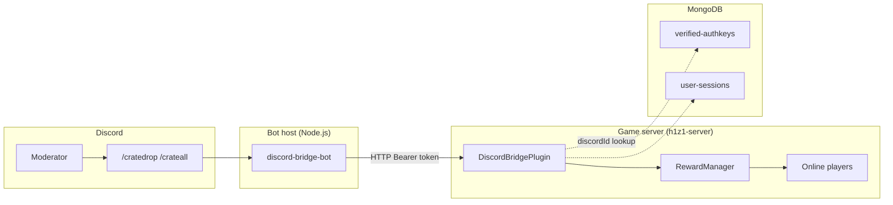
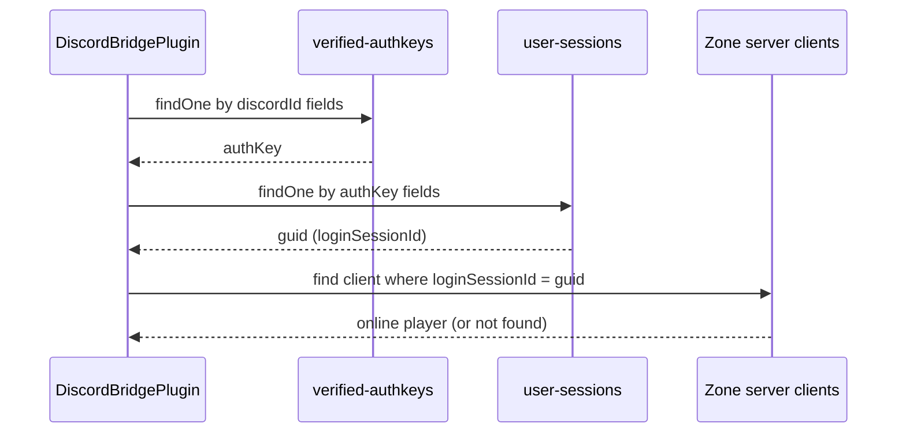

# H1Emu Discord Bridge

Connect your H1Emu / h1z1-server zone server to Discord so moderators and event staff can trigger **reward crate drops** for players without logging into the game.

This project is split into two parts that talk over a local HTTP API:

| Component | Location | Runs on | Purpose |
|-----------|----------|---------|---------|
| **DiscordBridgePlugin** | `plugin/` | Game server (inside zone server process) | Exposes HTTP endpoints for crate drops, player lists, and crate catalog |
| **Discord Bridge Bot** | `bot/` | Separate process (same or different machine) | Discord slash commands that call the plugin API |

The plugin **never connects to Discord directly**. That separation keeps the game server simple, makes the HTTP layer testable without Discord admin access, and lets you swap Discord for another chat platform later.

> **Status:** Private preview — API and bot are functional; live Discord testing requires admin access.

---

## Table of contents

- [Why this exists](#why-this-exists)
- [Architecture](#architecture)
- [Requirements](#requirements)
- [Quick start (test without Discord)](#quick-start-test-without-discord)
- [Installation — server plugin](#installation--server-plugin)
- [Installation — Discord bot](#installation--discord-bot)
- [Configuration reference](#configuration-reference)
- [HTTP API reference](#http-api-reference)
- [Discord slash commands](#discord-slash-commands)
- [Discord verification & player lookup](#discord-verification--player-lookup)
- [Deployment scenarios](#deployment-scenarios)
- [Security](#security)
- [Development & building](#development--building)
- [Comparison with in-game commands](#comparison-with-in-game-commands)
- [Reward crate ID reference](#reward-crate-id-reference)
- [Troubleshooting](#troubleshooting)
- [Roadmap](#roadmap)
- [License](#license)

---

## Why this exists

H1Emu servers already support admin crate drops in-game via commands like `/givereward` and `/giverewardtoall`. Staff do not always have access to a desktop / laptop. This solves that problem.

This bridge lets authorized Discord users:

- Drop crates to **one player** by in-game name
- Drop crates to **everyone online**
- Drop crates to a **verified Discord user** who is currently in-game
- List **online players** and **valid crate IDs** without opening the game client

You can validate the entire game-server integration using the included **CLI test tool** before anyone touches Discord server settings.

---

## Architecture



**Request flow for `/crateall`:**

1. Moderator runs `/crateall crate:5063` in Discord.
2. Bot checks the moderator's Discord role against `allowedRoleIds`.
3. Bot sends `POST /api/crate/drop` with `{ target: { type: "all" }, crateIds: [5063] }`.
4. Plugin validates the Bearer token and crate ID against `RewardManager.rewards`.
5. Plugin calls `rewardManager.addRewardToPlayer()` for each online client (same path as `/giverewardtoall`).
6. Plugin sends an in-game alert to all players and returns JSON to the bot.
7. Bot replies in Discord with a confirmation message.

---

## Requirements

### Game server

| Requirement | Notes |
|-------------|-------|
| [h1z1-server](https://github.com/H1emu/h1z1-server) with plugin support | 2016 zone server, **survival mode** (crate drops disabled in battle royale) |
| Node.js 18+ | On the machine running the zone server |
| Plugin folder | Copy `plugin/` into your server's `plugins/DiscordBridgePlugin/` |

### Discord bot (when ready to go live)

| Requirement | Notes |
|-------------|-------|
| Node.js 18+ | Can run on the same machine as the game server or elsewhere |
| Discord application + bot token | [Discord Developer Portal](https://discord.com/developers/applications) |
| Discord admin (one-time setup) | Invite bot, register slash commands, configure roles |
| Network path to plugin HTTP API | Default `http://127.0.0.1:9877` if co-located |

### Optional

| Requirement | Used for |
|-------------|----------|
| MongoDB | `/cratedropdiscord` and Discord-ID-based API targets |
| Discord verification bot | Players must appear in `verified-authkeys` collection |

Name-based drops (`/cratedrop`, `target.type: "name"`) work **without** MongoDB.

---

## Quick start (test without Discord)

Use this flow if you do not have Discord server admin access yet. It confirms the plugin and HTTP API work end-to-end.

### 1. Install the plugin on your zone server

Copy the `plugin/` folder to your server:

```
your-server/
  plugins/
    DiscordBridgePlugin/    ← contents of plugin/
      plugin.js
      src/
      data/
      package.json
      ...
```

Build:

```bash
cd plugins/DiscordBridgePlugin
npm install
npm run build
```

### 2. Set the API token

On first server start, the plugin manager creates `plugins/discordbridgeplugin-config.yaml`. Edit it:

```yaml
enabled: true
httpPort: 9877
bindAddress: "127.0.0.1"
apiToken: "paste-a-long-random-secret-here"
defaultActorName: "Discord"
```

Generate a strong token (example):

```bash
# Linux/macOS
openssl rand -hex 32

# PowerShell
[Convert]::ToBase64String((1..32 | ForEach-Object { Get-Random -Maximum 256 }))
```

### 3. Start the zone server

Look for:

```
[DiscordBridgePlugin] HTTP API listening on http://127.0.0.1:9877
[PluginManager] DiscordBridgePlugin initialized!
```

If you see a warning about `apiToken` not being set, the API will reject authenticated requests until you fix the config.

### 4. Run the test CLI

```bash
cd bot
cp config.example.json config.json
```

Edit `bot/config.json` — set `apiToken` to the **same value** as the plugin config:

```json
{
  "apiBaseUrl": "http://127.0.0.1:9877",
  "apiToken": "paste-a-long-random-secret-here"
}
```

Run tests:

```bash
npm install
npm run test-api                    # health check (no auth)
npm run test-api -- players         # online player list
npm run test-api -- crates          # valid crate IDs
npm run test-api -- drop-all 5063   # drop H1Emu crate to everyone online
npm run test-api -- drop-name "YourCharacterName" 5063
```

**Success criteria:** `drop-all` or `drop-name` returns `"ok": true` and players receive crates in-game with an alert message.

### 5. In-game status command

Moderators can run:

```
/discordbridge status
```

Shows the API bind address and current online player count.

---

## Installation // server plugin

### Directory layout

The plugin manager loads folders from `plugins/`. The folder **must** be named `DiscordBridgePlugin` and contain `plugin.js` at its root.

```
plugins/
  DiscordBridgePlugin/
    plugin.js              → requires ./out/plugin
    out/
      plugin.js            → compiled output (npm run build)
    src/
      plugin.ts
    data/
      defaultconfig.yaml   → defaults copied on first load
    package.json
    tsconfig.json
```

### Build from source

```bash
cd plugins/DiscordBridgePlugin
npm install
npm run build
```

The server will attempt `npm install` automatically on first load if `node_modules/` is missing.

### Production install (release zip)

Maintainers can package a release:

```bash
cd plugin
npm install
npm run build
npm run pack:release
```

This produces `dist/discordbridgeplugin-1.0.0.zip`. Server owners unzip into `plugins/DiscordBridgePlugin/` and run:

```bash
npm install --omit=dev
```

### Config file location

After first load:

```
plugins/discordbridgeplugin-config.yaml
```

Values merge over `data/defaultconfig.yaml`. Restart the server after config changes.

---

## Installation — Discord bot

Complete this section when someone with **Manage Server** on your Discord guild is available.

### Step 1 — Create a Discord application

1. Open https://discord.com/developers/applications
2. Click **New Application** → choose a name (e.g. `H1Emu Server Bot`)
3. Go to **Bot** → **Add Bot**
4. Under **Token**, click **Reset Token** and copy it → save as `bot/config.json` → `discordToken`
5. Go to **OAuth2** → **General** → copy **Client ID** → `config.json` → `clientId`

> Never commit `config.json` with real tokens. Only `config.example.json` belongs in git.

### Step 2 — Invite the bot to your guild

1. **OAuth2** → **URL Generator**
2. Scopes: `bot`, `applications.commands`
3. Bot permissions: none required (commands are role-gated in code)
4. Open the generated URL in a browser and add the bot to your server
5. Enable **Developer Mode** in Discord (Settings → Advanced)
6. Right-click your server icon → **Copy Server ID** → `config.json` → `guildId`

### Step 3 — Configure the bot

```bash
cd bot
cp config.example.json config.json
```

Full `config.json` example:

```json
{
  "apiBaseUrl": "http://127.0.0.1:9877",
  "apiToken": "same-secret-as-plugin-config",

  "discordToken": "YOUR_BOT_TOKEN",
  "clientId": "YOUR_APPLICATION_CLIENT_ID",
  "guildId": "YOUR_GUILD_ID",

  "allowedRoleIds": ["1234567890123456789"],
  "defaultCrateId": 5063
}
```

| Field | Description |
|-------|-------------|
| `apiBaseUrl` | Plugin HTTP base URL (no trailing slash) |
| `apiToken` | Must match `plugins/discordbridgeplugin-config.yaml` |
| `discordToken` | Bot token from Developer Portal |
| `clientId` | Application client ID |
| `guildId` | Discord server ID (guild-scoped slash commands) |
| `allowedRoleIds` | Discord role IDs allowed to run admin commands. Empty = require Administrator permission |
| `defaultCrateId` | Crate used when slash command omits the `crate` option |

### Step 4 — Register slash commands

Guild commands update instantly (unlike global commands which can take up to an hour):

```bash
cd bot
npm install
npm run register-commands
```

Expected output:

```
Registering 5 slash command(s)...
Done. Slash commands should appear in your guild shortly.
```

### Step 5 — Run the bot

```bash
npm start
```

Expected output:

```
Discord bridge bot logged in as H1Emu Server Bot#1234
Game API: http://127.0.0.1:9877
```

Keep this process running (systemd, pm2, Docker, or a screen/tmux session on Linux).

---

## Configuration reference

### Plugin — `plugins/discordbridgeplugin-config.yaml`

| Option | Type | Default | Description |
|--------|------|---------|-------------|
| `enabled` | boolean | `true` | Master switch. `false` disables the HTTP server entirely. |
| `httpPort` | number | `9877` | TCP port for the HTTP API |
| `bindAddress` | string | `127.0.0.1` | Listen address. Use `0.0.0.0` only if remote bots need access and you understand the security implications. |
| `apiToken` | string | *(empty)* | **Required.** Bearer token for `/api/*` routes. Reject all requests if unset or still the placeholder. |
| `defaultActorName` | string | `Discord` | Prefix shown in in-game announcements when `actor` is omitted from API requests |
| `userSessionsCollection` | string | `user-sessions` | MongoDB collection linking auth keys to login session GUIDs |
| `authKeysCollection` | string | `verified-authkeys` | MongoDB collection for Discord-verified players |
| `discordIdFields` | string[] | see default | Field names tried when looking up a Discord user ID in `verified-authkeys` |
| `authKeyFields` | string[] | see default | Field names tried for auth key values across collections |

### Bot — `bot/config.json`

| Field | Type | Required | Description |
|-------|------|----------|-------------|
| `apiBaseUrl` | string | yes | Plugin URL, e.g. `http://127.0.0.1:9877` |
| `apiToken` | string | yes | Must match plugin `apiToken` |
| `discordToken` | string | for bot | Bot token |
| `clientId` | string | for bot | Application client ID |
| `guildId` | string | for bot | Target guild for slash commands |
| `allowedRoleIds` | string[] | no | Moderator role IDs. Empty = Administrator only |
| `defaultCrateId` | number | no | Default `5063` (H1Emu crate) |

---

## HTTP API reference

Base URL: `http://HOST:9877` (configurable)

### Authentication

| Route | Auth required |
|-------|---------------|
| `GET /health` | No |
| All `/api/*` routes | Yes — header `Authorization: Bearer YOUR_API_TOKEN` |

### `GET /health`

Liveness check. Does not require authentication.

**Example:**

```bash
curl -s http://127.0.0.1:9877/health
```

**Response `200`:**

```json
{
  "ok": true,
  "plugin": "DiscordBridgePlugin",
  "version": "1.0.0",
  "playersOnline": 12
}
```

---

### `GET /api/players`

List all currently connected players.

**Example:**

```bash
curl -s -H "Authorization: Bearer YOUR_TOKEN" \
  http://127.0.0.1:9877/api/players
```

**Response `200`:**

```json
{
  "ok": true,
  "players": [
    {
      "name": "Player_One",
      "loginSessionId": "abc123-guid-here"
    }
  ]
}
```

---

### `GET /api/crates`

List all reward crate IDs the server recognizes (from `RewardManager.rewards`).

**Example:**

```bash
curl -s -H "Authorization: Bearer YOUR_TOKEN" \
  http://127.0.0.1:9877/api/crates
```

**Response `200`:**

```json
{
  "ok": true,
  "crates": [
    { "id": 5063, "name": "REWARD_CRATE_H1EMU", "droppable": true },
    { "id": 5026, "name": "REWARD_CRATE_H1EMUEXCLUSIVE", "droppable": false }
  ]
}
```

`droppable: false` means the crate exists but has `dropChances: 0` (admin-only / event crates). You can still drop them via the API.

---

### `POST /api/crate/drop`

Give one or more reward crates to a player or all online players.

**Headers:**

```
Authorization: Bearer YOUR_TOKEN
Content-Type: application/json
```

**Body:**

```json
{
  "target": {
    "type": "all | name | discordId",
    "value": "required for name and discordId"
  },
  "crateIds": [5063, 5064],
  "actor": "Optional display name for announcements",
  "announce": "Optional custom in-game alert text"
}
```

#### Target types

| `type` | `value` | Behavior |
|--------|---------|----------|
| `all` | omit | Every online player receives all listed crates |
| `name` | in-game character name | Fuzzy name match (same logic as `/givereward`). Player must be online. |
| `discordId` | Discord snowflake ID | Looks up verified auth key in MongoDB, resolves session GUID, finds online client. Player must be verified **and** online. |

#### Examples

**Drop to everyone:**

```bash
curl -s -X POST \
  -H "Authorization: Bearer YOUR_TOKEN" \
  -H "Content-Type: application/json" \
  -d '{"target":{"type":"all"},"crateIds":[5063],"actor":"Event Team","announce":"Community crate drop!"}' \
  http://127.0.0.1:9877/api/crate/drop
```

**Drop to one player by name:**

```json
{
  "target": { "type": "name", "value": "Player_One" },
  "crateIds": [3626]
}
```

**Drop to verified Discord user:**

```json
{
  "target": { "type": "discordId", "value": "123456789012345678" },
  "crateIds": [5063]
}
```

#### Success response `200` (all players)

```json
{
  "ok": true,
  "action": "drop_all",
  "recipients": ["Player_One", "Player_Two"],
  "crateIds": [5063],
  "crateNames": "REWARD_CRATE_H1EMU",
  "message": "Event Team has initiated a crate drop for everyone"
}
```

#### Success response `200` (single player)

```json
{
  "ok": true,
  "action": "drop_player",
  "player": "Player_One",
  "crateIds": [5063],
  "crateNames": "REWARD_CRATE_H1EMU",
  "message": "Event Team rewarded Player_One with REWARD_CRATE_H1EMU"
}
```

#### Error responses

| Status | Condition | Example body |
|--------|-----------|--------------|
| `400` | Missing/invalid `crateIds` | `{ "ok": false, "error": "crateIds must be a non-empty array of numbers" }` |
| `400` | Battle royale server | `{ "ok": false, "error": "Crate drops are not available in battle royale" }` |
| `401` | Bad or missing token | `{ "ok": false, "error": "Unauthorized" }` |
| `404` | Player not found | `{ "ok": false, "error": "Player not found or not online" }` |
| `404` | Discord ID not online/verified | `{ "ok": false, "error": "No online player found for that Discord ID (must be verified and in-game)" }` |
| `404` | Fuzzy name suggestion | `{ "ok": false, "error": "Player not found. Did you mean player_one?" }` |
| `500` | Internal error | `{ "ok": false, "error": "..." }` |

If some crate IDs are invalid but at least one is valid, the drop proceeds and invalid IDs appear in `"invalid": [9999]` on success responses.

---

## Discord slash commands

| Command | Visibility | Description |
|---------|------------|-------------|
| `/players` | Ephemeral (only you) | Lists online in-game character names |
| `/crates` | Ephemeral | Shows first 25 crate IDs and names |
| `/cratedrop` | Public reply | Drop crate(s) to a player by **in-game name** |
| `/crateall` | Public reply | Drop crate(s) to **everyone online** |
| `/cratedropdiscord` | Public reply | Drop crate(s) to a **@Discord user** (verified + in-game) |

### `/cratedrop`

| Option | Required | Description |
|--------|----------|-------------|
| `player` | yes | In-game character name |
| `crate` | no | Crate ID (defaults to `defaultCrateId`) |
| `message` | no | Custom in-game announcement |

### `/crateall`

| Option | Required | Description |
|--------|----------|-------------|
| `crate` | no | Crate ID |
| `message` | no | Custom in-game announcement |

### `/cratedropdiscord`

| Option | Required | Description |
|--------|----------|-------------|
| `user` | yes | Discord user mention |
| `crate` | no | Crate ID |

---

## Discord verification & player lookup

The `/cratedropdiscord` command and `target.type: "discordId"` API target resolve players through MongoDB — the same collections used by H1Emu's Discord verification flow and the `PlayerLookupPlugin`.



**Requirements for Discord-ID drops:**

1. Player completed Discord verification (document exists in `verified-authkeys`)
2. Player has an active session in `user-sessions` linked by auth key
3. Player is **currently online** on the zone server

If any step fails, the API returns `404`.

**Custom field names:** If your verification bot stores Discord IDs under different property names, adjust `discordIdFields` and `authKeyFields` in the plugin config.

---

## Deployment scenarios

### A — Same machine (recommended)

```
Game server + plugin  →  127.0.0.1:9877
Discord bot           →  apiBaseUrl: http://127.0.0.1:9877
```

- Keep `bindAddress: "127.0.0.1"`
- No firewall changes needed
- Lowest attack surface

### B — Bot on a separate machine

```
Game server (VPS)     →  bindAddress: "0.0.0.0", httpPort: 9877
Discord bot (home)    →  apiBaseUrl: http://VPS_IP:9877
```

- Open port `9877` in the VPS firewall **only** for the bot's IP if possible
- Use a strong `apiToken` (32+ random bytes)
- Prefer a VPN or SSH tunnel over exposing plain HTTP to the internet

### C — Production hardening

For anything beyond a trusted LAN:

- Put nginx/Caddy in front with TLS termination
- Restrict source IPs
- Rotate `apiToken` periodically
- Run the bot under a process manager with auto-restart

---

## Security

| Risk | Mitigation |
|------|------------|
| Unauthorized crate drops | Bearer token on all `/api/*` routes; long random secret |
| Token leakage | Never commit `config.json` or `discordbridgeplugin-config.yaml` with real secrets |
| API exposed to internet | Default bind is localhost; use TLS + IP allowlist if remote |
| Discord command abuse | `allowedRoleIds` or Administrator check on every slash command |
| Bot token theft | Treat like a password; reset in Developer Portal if leaked |

The plugin uses the same reward delivery path as in-game admin commands — it cannot create arbitrary items, only crates listed in `RewardManager.rewards`.

---

## Development & building

### Repository layout

```
h1emu-discord-bridge/
  README.md           ← this file
  plugin/             ← DiscordBridgePlugin source
  bot/                ← Discord bot + test CLI
  .gitignore
```

When developing inside the full h1z1-server repo, these live at:

- `plugins/DiscordBridgePlugin/`
- `tools/discord-bridge-bot/`

### Build the plugin

```bash
cd plugin
npm install
npm run build
```

TypeScript compiles `src/plugin.ts` → `out/plugin.js`. Entry point `plugin.js` re-exports the compiled module.

### Test CLI commands

```bash
cd bot
npm run test-api                          # help / health
npm run test-api -- health
npm run test-api -- players
npm run test-api -- crates
npm run test-api -- drop-all 5063
npm run test-api -- drop-name "Name" 5063
npm run test-api -- drop-discord 123456789012345678 5063
```

### Package a release

```bash
cd plugin
npm run pack:release
# → dist/discordbridgeplugin-1.0.0.zip
```

---

## Comparison with in-game commands

| In-game command | Discord / API equivalent |
|-----------------|--------------------------|
| `/givereward {id} {player}` | `POST /api/crate/drop` with `target.type: "name"` or `/cratedrop` |
| `/giverewardtoall {id}` | `POST /api/crate/drop` with `target.type: "all"` or `/crateall` |
| `/players` | `GET /api/players` or `/players` slash command |
| N/A (Discord ID) | `target.type: "discordId"` or `/cratedropdiscord` |

The bridge does **not** implement `/globalrewardtoall` (server-wide broadcast popup) yet — it uses in-game alerts via `sendAlertToAll`. See [Roadmap](#roadmap).

---

## Reward crate ID reference

Common crates (not exhaustive — run `GET /api/crates` for your server):

| ID | Name | Notes |
|----|------|-------|
| 5063 | REWARD_CRATE_H1EMU | Default in bot config |
| 5064 | REWARD_CRATE_VICTORY | |
| 5026 | REWARD_CRATE_H1EMUEXCLUSIVE | Admin/event (`droppable: false`) |
| 3626 | REWARD_CRATE_MARAUDER | |
| 3630 | REWARD_CRATE_SHOWDOWN | |
| 3629 | REWARD_CRATE_INVITATIONAL | |
| 3821 | REWARD_CRATE_INFERNAL | |
| 3623 | REWARD_CRATE_ALPHA_LAUNCH | |
| 3208 | REWARD_CRATE_PREDATOR | |
| 3119 | REWARD_CRATE_EZW | |
| 2890 | REWARD_CRATE_RENEGADE | |
| 3025 | REWARD_CRATE_WASTELAND | |
| 3502 | REWARD_CRATE_RONIN | |
| 3628 | REWARD_CRATE_MERCENARY | |
| 3624 | REWARD_CRATE_WEARABLES | |
| 3627 | REWARD_CRATE_VIGILANTE | |
| 5255 | REWARD_CRATE_BREAKOUT | |
| 5256 | REWARD_CRATE_SWIRL | |
| 5333 | REWARD_CRATE_INFERNAL_2025 | Event crate |
| 5375 | REWARD_CRATE_FROST | Event crate |

---

## Troubleshooting

### Plugin not loading

| Symptom | Fix |
|---------|-----|
| No `[DiscordBridgePlugin]` in console | Ensure folder is named `DiscordBridgePlugin` with `plugin.js` at root |
| `Cannot find module './out/plugin'` | Run `npm run build` inside the plugin folder |
| Plugin loads on login server only | Expected — HTTP API starts only on the **zone** server |

### HTTP API

| Symptom | Fix |
|---------|-----|
| `401 Unauthorized` | Match `apiToken` in plugin config and bot/CLI config |
| `EADDRINUSE` port 9877 | Change `httpPort` in config |
| Connection refused | Zone server not running, wrong port, or wrong `bindAddress` |
| Warning about apiToken on startup | Set a real token in `discordbridgeplugin-config.yaml` |

### Crate drops

| Symptom | Fix |
|---------|-----|
| `"No valid crate IDs"` | Use IDs from `GET /api/crates` |
| Player not found | Exact name may differ — check `/players` or use fuzzy suggestion in error |
| Discord ID not found | Player must be verified in MongoDB **and** online |
| No crates received | Player inventory may be full; check server logs |
| Battle royale error | Crate drops only work in survival mode |

### Discord bot

| Symptom | Fix |
|---------|-----|
| Slash commands not visible | Run `npm run register-commands`; wait ~1 minute |
| "You do not have permission" | Add your role ID to `allowedRoleIds` or grant Administrator |
| Bot online but commands fail | Check bot can reach `apiBaseUrl`; test with `npm run test-api` from same host |
| Invalid token on login | Reset bot token in Developer Portal, update `config.json` |

### MongoDB / verification

| Symptom | Fix |
|---------|-----|
| Discord lookup always 404 | Confirm document in `verified-authkeys` with expected field names |
| Works in PlayerLookupPlugin but not here | Align `discordIdFields` / `authKeyFields` in plugin config |
| Solo mode server | Discord-ID lookup requires MongoDB (not available in solo mode) |

---

## Roadmap

Planned improvements (not yet implemented):

- [ ] `/globalreward`-style server-wide broadcast popup
- [ ] Webhook notifications back to Discord when drops occur
- [ ] Scheduled / recurring crate events
- [ ] Audit log (who dropped what, when)
- [ ] Multi-crate option on slash commands
- [ ] systemd / pm2 example unit files

---

## License

GPL-3.0-only — same as [h1z1-server](https://github.com/H1emu/h1z1-server).

---

## Links

- [h1z1-server](https://github.com/H1emu/h1z1-server) — H1Emu game server
- [Discord Developer Portal](https://discord.com/developers/applications) — create bot applications
- [H1Emu Discord](https://discord.gg/RM6jNkj) — community support
